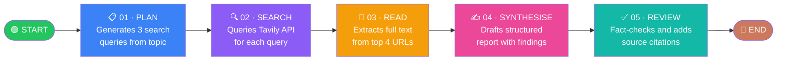

<div align="center">

# 🔬 Autonomous Research Agent

### *Intelligent multi-step research powered by LangGraph + Groq + Tavily*

<br/>

[](https://python.org)
[](https://streamlit.io)
[](https://langchain-ai.github.io/langgraph/)
[](https://groq.com)
[](https://tavily.com)
[](LICENSE)
[](https://share.streamlit.io)

<br/>

> **Give it a topic. It plans, searches, reads, synthesises, and fact-checks — completely autonomously.**

<br/>


</div>

---

## 📖 Table of Contents

- [✨ Overview](#-overview)
- [🏗️ Architecture](#️-architecture)
- [🔁 Pipeline Flow](#-pipeline-flow)
- [⚙️ Tech Stack](#️-tech-stack)
- [📁 Project Structure](#-project-structure)
- [🚀 Quick Start (Local)](#-quick-start-local)
- [☁️ Deploy to Streamlit Cloud](#️-deploy-to-streamlit-cloud)
- [🔐 Environment Variables](#-environment-variables)
- [🖥️ UI Walkthrough](#️-ui-walkthrough)
- [📦 Dependencies](#-dependencies)
- [🤝 Contributing](#-contributing)

---

## ✨ Overview

The **Autonomous Research Agent** is a production-ready AI pipeline that performs **end-to-end research** on any topic you give it. Instead of a single LLM call, it orchestrates a **5-node graph** — each node specialising in one step of the research process — to deliver a verified, source-backed report.

| 💡 Feature | 📝 Description |
|---|---|
| 🧠 **Smart Planning** | Breaks your topic into 3 targeted search queries |
| 🔍 **Real-time Search** | Queries the live web via Tavily Search API |
| 📄 **Deep Reading** | Extracts full article text from top URLs |
| ✍️ **AI Synthesis** | Writes a structured report with key findings |
| ✅ **Fact Checking** | Reviews and removes unsupported claims |
| 🎨 **Beautiful UI** | Warm, minimalist Streamlit frontend |
| 📡 **Streaming Progress** | Live pipeline step indicators as it runs |

---

## 🏗️ Architecture

```
┌─────────────────────────────────────────────────────────────────┐
│                    RESEARCH AGENT SYSTEM                        │
│                                                                 │
│   ┌──────────┐    ┌──────────┐    ┌──────────┐                │
│   │  User    │───▶│ Streamlit│───▶│  Agent   │                │
│   │  Input   │    │ Frontend │    │  Graph   │                │
│   └──────────┘    └──────────┘    └────┬─────┘                │
│                                        │                        │
│              ┌─────────────────────────▼──────────────────┐    │
│              │            LangGraph StateGraph             │    │
│              │                                             │    │
│              │  ┌──────┐ ┌──────┐ ┌──────┐ ┌──────────┐ │    │
│              │  │ Plan │▶│Search│▶│ Read │▶│Synthesise│ │    │
│              │  └──────┘ └──────┘ └──────┘ └────┬─────┘ │    │
│              │                                   │        │    │
│              │                            ┌──────▼──────┐ │    │
│              │                            │   Review    │ │    │
│              │                            └──────┬──────┘ │    │
│              └───────────────────────────────────┼────────┘    │
│                                                  │              │
│                                         ┌────────▼────────┐    │
│                                         │  Final Report   │    │
│                                         └─────────────────┘    │
└─────────────────────────────────────────────────────────────────┘
```

---

## 🔁 Pipeline Flow

Each research run passes through **5 sequential nodes**, all wired into a LangGraph `StateGraph`:



### Node Breakdown

| # | Node | Model/Tool | Input | Output |
|---|------|-----------|-------|--------|
| 01 | 📋 **Plan** | `LLaMA 3.3-70B` | `topic` | `search_queries: List[str]` |
| 02 | 🔍 **Search** | `Tavily Search` | `search_queries` | `search_results: List[Dict]` |
| 03 | 📄 **Read** | `Tavily Extract` | `search_results` (top 4 URLs) | `full_text: str` |
| 04 | ✍️ **Synthesise** | `LLaMA 3.3-70B` | `topic` + `full_text` | `report: str` |
| 05 | ✅ **Review** | `LLaMA 3.3-70B` | `full_text` + `report` | `final_report: str` |

---

## ⚙️ Tech Stack

<div align="center">

| Layer | Technology | Role |
|---|---|---|
| 🖼️ **Frontend** | [Streamlit](https://streamlit.io) | Interactive web UI with live pipeline status |
| 🧠 **Orchestration** | [LangGraph](https://langchain-ai.github.io/langgraph/) | Multi-node stateful agent graph |
| 🤖 **LLM** | [Groq](https://groq.com) · LLaMA 3.3-70B | Ultra-fast inference for planning, synthesis, review |
| 🔍 **Search** | [Tavily](https://tavily.com) | Real-time web search + full-text extraction |
| 🔗 **Prompting** | [LangChain Core](https://python.langchain.com) | Prompt templates + output parsers |
| 📦 **Config** | [python-dotenv](https://pypi.org/project/python-dotenv/) | Local `.env` secret management |

</div>

---

## 📁 Project Structure

```
research-agent-proj-v1/
│
├── 🤖 agent.py              # Core agent — LangGraph graph, 5 nodes, run_agent()
├── 🖥️ frontend.py           # Streamlit UI — input, live progress, report display
├── 📋 requirements.txt      # All Python dependencies
│
├── 🔐 .env                  # LOCAL ONLY — API keys (never committed)
├── 🚫 .gitignore            # Hides .env, venv, __pycache__
│
└── 📁 .streamlit/
    └── 🔑 secrets.toml      # LOCAL ONLY — Streamlit secrets (gitignored)
```

---

## 🚀 Quick Start (Local)

### 1️⃣ Clone the Repository

```bash
git clone https://github.com/mr-ahtashamulhaq/research-agent-proj-v1.git
cd research-agent-proj-v1
```

### 2️⃣ Create & Activate Virtual Environment

```bash
# Windows
python -m venv venv
venv\Scripts\activate

# macOS / Linux
python -m venv venv
source venv/bin/activate
```

### 3️⃣ Install Dependencies

```bash
pip install -r requirements.txt
```

### 4️⃣ Set Up Your API Keys

Create a `.env` file in the project root:

```env
GROQ_API_KEY=your_groq_api_key_here
TAVILY_API_KEY=your_tavily_api_key_here
```

> 🔑 Get your keys from:
> - **Groq**: [console.groq.com](https://console.groq.com) — Free tier, blazing fast
> - **Tavily**: [tavily.com](https://tavily.com) — Free tier, 1000 searches/month

### 5️⃣ Run the App

```bash
streamlit run frontend.py
```

🎉 Open your browser at **http://localhost:8501** and start researching!

---

## ☁️ Deploy to Streamlit Cloud

> **Streamlit Cloud** is the best free hosting for this app — zero config, automatic deploys on every Git push.

### Step-by-Step Deployment

```
1. Push your code to GitHub (already done ✅)
        ↓
2. Go to share.streamlit.io → Sign in with GitHub
        ↓
3. Click "New app"
        ↓
4. Select repo: mr-ahtashamulhaq/research-agent-proj-v1
   Main file path: frontend.py
        ↓
5. Click "Advanced settings" → Add secrets (see below)
        ↓
6. Click "Deploy!" 🚀
```

### Streamlit Cloud Secrets

Paste this into **Settings → Secrets** in the Streamlit Cloud dashboard:

```toml
GROQ_API_KEY = "your_groq_api_key_here"
TAVILY_API_KEY = "your_tavily_api_key_here"
```

> ⚠️ **Never paste secrets in a public repo!** Always use the Streamlit dashboard secrets panel.

---

## 🔐 Environment Variables

| Variable | Required | Where to Get |
|---|---|---|
| `GROQ_API_KEY` | ✅ Yes | [console.groq.com](https://console.groq.com) |
| `TAVILY_API_KEY` | ✅ Yes | [app.tavily.com](https://app.tavily.com) |

### How secrets are loaded (priority order):

```
1. 🌐 Streamlit Cloud   →  st.secrets["KEY"]        (production)
2. 📄 .env file          →  python-dotenv load_dotenv() (local dev)
3. 💻 System env vars    →  os.environ["KEY"]         (fallback)
```

---

## 🖥️ UI Walkthrough

```
┌─────────────────────────────────────────────────────────┐
│  AUTONOMOUS RESEARCH AGENT                              │
│  Research. Verified.                                    │
│  [01:Plan] [02:Search] [03:Read] [04:Synthesise] [05:Review] │
├─────────────────────────────────────────────────────────┤
│  Research Query                                         │
│  ┌─────────────────────────────────────┐ ┌───────────┐ │
│  │ e.g. How is AI used in Pakistan...  │ │ RUN AGENT │ │
│  └─────────────────────────────────────┘ └───────────┘ │
├─────────────────────────────────────────────────────────┤
│  PIPELINE PROGRESS                                      │
│  + Plan      : Generating search queries                │
│  + Search    : Querying Tavily                          │
│  > Read      : Extracting article text  ← (live!)      │
│  - Synthesise: Drafting report                          │
│  - Review    : Fact-checking and finalizing             │
├─────────────────────────────────────────────────────────┤
│  FINAL REPORT  │  your topic here                       │
│─────────────────────────────────────────────────────────│
│                                                         │
│  ## Introduction                                        │
│  ...                                                    │
│  ## Key Findings                                        │
│  1. ...                                                 │
│  ## Conclusion                                          │
│  ...                                                    │
│  ## Sources                                             │
│  - [Article Title](url)                                 │
│                                                         │
│  ▼ Sources and URLs                                     │
│  ▼ Search Queries Generated                             │
└─────────────────────────────────────────────────────────┘
```

---

## 📦 Dependencies

```txt
langgraph>=0.2.0          # Agent graph orchestration
langchain-groq>=0.1.0     # Groq LLM integration
langchain-core>=0.2.0     # Prompt templates, output parsers
tavily-python>=0.3.0      # Web search + article extraction
typing_extensions>=4.5.0  # TypedDict support
streamlit>=1.35.0         # Web frontend
python-dotenv>=1.0.0      # .env file loading
```

Install all at once:

```bash
pip install -r requirements.txt
```

---

## 🤝 Contributing

Contributions, ideas, and improvements are very welcome!

```
1. 🍴 Fork the repository
2. 🌿 Create a feature branch  →  git checkout -b feature/amazing-feature
3. 💾 Commit your changes      →  git commit -m "feat: add amazing feature"
4. 📤 Push to the branch       →  git push origin feature/amazing-feature
5. 🔁 Open a Pull Request
```

---

<div align="center">

### 🌟 If this project helped you, give it a star!

Made with ❤️ using **LangGraph**, **Groq**, **Tavily** & **Streamlit**

[](https://github.com/mr-ahtashamulhaq/research-agent-proj-v1)

</div>
